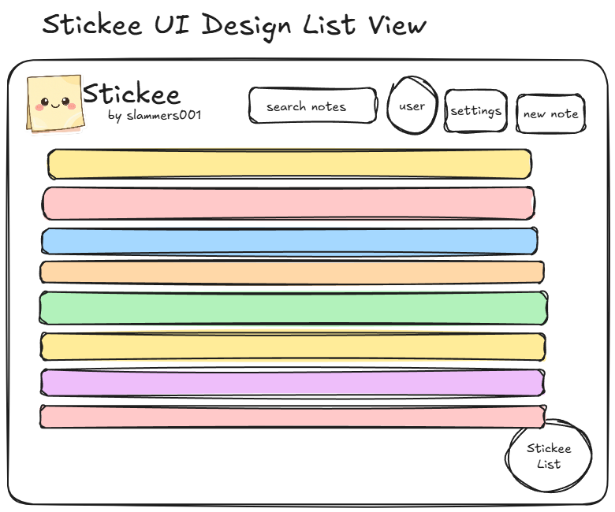

# Stickee: The Modern Desktop Sticky Note Application
Stickee is a modern desktop application designed for managing and organizing digital sticky notes. Built with React, TypeScript, and Tauri, it combines the simplicity of traditional sticky notes with powerful digital features.
To learn about Stickee, go to [https://stickee-info.simicodes.xyz](https://stickee-info.simicodes.xyz/).

<!---->

## Key Features

* **Intuitive Interface:** Drag-and-drop interface for arranging notes with a fun, interactive experience.
* **Cloud Synchronization:** Seamlessly sync notes across devices.
* **Extensive Customization:**
    * 10 Note Colors
    * 60+ Font Choices (including handwriting styles)
    * Light & Dark Theme Support
    * Emoji Reactions
* **Smart Features:**
    * Automatic URL Detection
    * Keyboard Shortcuts (N for new note, Alt+P for quick note window)
    * Comprehensive Search Function (content, titles, colors, statuses)
* **CRUD Operations:** Full Create, Read, Update, and Delete (CRUD) functionality for notes.
* **Data Encryption:** Robust security with encryption of note content and titles in the Supabase database.

## Core Functionality

### Note Management

* **Note Attributes:** Each note includes timestamps, user associations, and optional titles alongside the main content.
* **Note Statuses:** Categorize notes with To-Do, Doing, Done, and Backlog statuses.
* **Pinning:** Pin important notes to the top for immediate visibility.

### Enhanced Features

* **Checklists:** Create nested task lists within notes, toggle completion states, and dynamically add/delete tasks. Ideal for project management and task tracking.
* **Search:** Real-time filtering across note content, titles, colors, and statuses, optimized for performance.
* **View Modes:** Grid and List views for flexible data visualization.
* **Emoji Reactions:** Add visual feedback to notes and categorize them with emoji reactions, tracked with counts.

## Technical Details

* **Technology Stack:**
    * **Framework:** React, TypeScript
    * **Desktop Framework:** Tauri
    * **Database:** Supabase
    * **State Management:** React Query
    * **UI Components:** Radix UI
* **Architecture:** Clean separation of concerns (UI, Business Logic, Data Services) with TypeScript for type safety and service layer abstraction.
* **Scalability & Maintainability:** Designed for scalability and easy maintenance through modular design and TypeScript.

## Design & User Experience

Stickee emphasizes both functionality and user experience with:

*   Smooth animations
*   Intuitive interactions
*   A playful aesthetic
